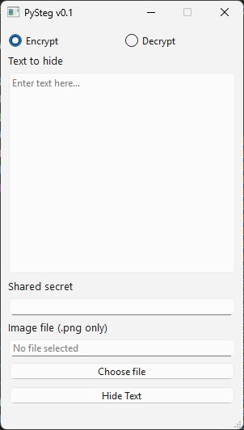

# PySteg

[](https://github.com/kisscool-fr/pysteg/actions/workflows/ci.yml)

A simple GUI for steganography: hide and reveal secret messages in images, with optional AES-256 encryption.

Built as a replacement for [Steganozorus](https://thomasnerrant.com/steganozorus.htm) © 2002 – [Thomas Nerrant](https://thomasnerrant.com/).

## Sponsor

If you find this project useful, consider [buying me a coffee](https://www.buymeacoffee.com/kisscool).

## Features

- **Hide and reveal messages** in PNG images using LSB steganography
- **AES-256 encryption** for the hidden payload
- Desktop GUI built with PyQt6

## Requirements

- Python 3.13
- [uv](https://docs.astral.sh/uv/) (recommended) or pip
- [just](https://github.com/casey/just) (optional, for recipe commands)

## Installation

```bash
just install
```

Or with uv directly:

```bash
uv sync
```

## Usage

```bash
just run
```

Or:

```bash
uv run pysteg
```

## Screenshot



## Roadmap

- [ ] Choose output file name
- [ ] Add support for more encryption algorithms
- [ ] Add support for keyfiles
- [ ] Add support for more media (images, audio, video, drag & drop)
- [ ] Deniability support
- [ ] More languages
- [ ] Binary release
- [ ] Design improvements

## License

[MIT](LICENSE)

## Credits

[KisSCoOl](https://github.com/kisscool-fr/)
