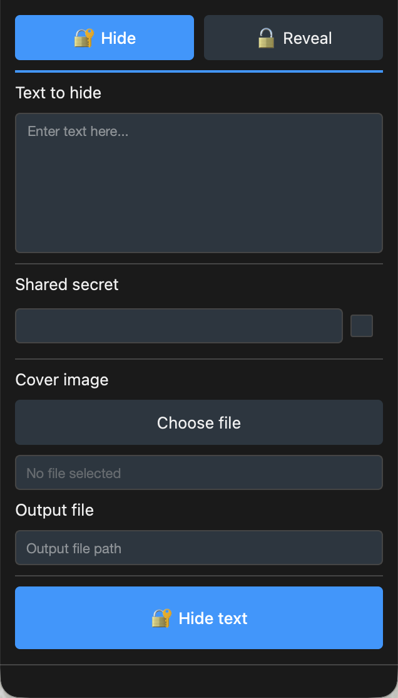

# PySteg

[](https://github.com/kisscool-fr/pysteg/actions/workflows/ci.yml)

A simple GUI for steganography: hide and reveal secret messages in images, with optional AES-256-GCM encryption and Argon2id key derivation.

Built as a replacement for [Steganozorus](https://thomasnerrant.com/steganozorus.htm) © 2002 – [Thomas Nerrant](https://thomasnerrant.com/).

> **Warning:** PySteg is still under active development. Backward compatibility for hidden text is not guaranteed before version 1.0 (messages encoded with an earlier release may not be readable after an upgrade).

## Sponsor

If you find this project useful, consider [buying me a coffee](https://www.buymeacoffee.com/kisscool).

## Features

- **Hide and reveal messages** in image files using LSB or EXIF steganography
- **AES-256-GCM encryption** with Argon2id key derivation from a shared secret
- **Plain text mode** to hide a message without encryption (useful for testing or low-risk payloads)
- Desktop GUI built with PyQt6

### Supported media formats

PySteg uses [Stegano](https://github.com/cedricbonhomme/Stegano) for steganography.

| Format | Technique | Support |
|--------|-----------|---------|
| PNG, BMP | LSB (least significant bit) | ✅ |
| JPEG, TIFF | EXIF header | ✅ |
| WAV | LSB | 🔜 |
| PNG (grayscale) | RDH (reversible histogram shifting) | 🔜 |
| RGB images (PNG, BMP, JPEG, …) | RED (red channel) | 🔜 |

✅ supported today · 🔜 available in Stegano, planned for PySteg integration

## Requirements

- Python 3.13
- [uv](https://docs.astral.sh/uv/) (recommended) or pip
- [just](https://github.com/casey/just) (optional, for recipe commands)

## Installation

First-time setup (creates a virtual environment with the Python version from `.python-version`):

```bash
just init
just install
```

Or with uv directly:

```bash
uv sync
```

## Usage

```bash
just run
```

Or:

```bash
uv run -m app
```

1. Choose **Hide** or **Reveal** mode.
2. Enter the text to hide, or leave the field empty in reveal mode.
3. Enter a shared secret (at least 8 characters), or enable plain text mode to skip encryption.
4. Select a cover image. The output file path is pre-filled automatically; edit it if you want a different name or location.
5. Run the action.

## Development

Common tasks via [just](https://github.com/casey/just):

```bash
just test      # run pytest
just format    # lint and format with ruff
just typing    # type-check with pyright
just ci        # full local CI pipeline
```

List all recipes with `just --list`.

## Screenshots

PySteg is a native desktop app on macOS and Windows. The main window in **Hide** mode:

| macOS (v0.4) | Windows (v0.1) |
| :---: | :---: |
|  |  |

## Roadmap

- [x] Choose output file name
- [ ] Add pane to choose encryption / diffusion algorithm
- [ ] Add support for more encryption algorithms
- [ ] Add support for keyfiles
- [ ] Audio and video support, drag & drop
- [ ] Deniability support
- [ ] Self-destructing messages (one-time reveal that restores the original cover)
- [ ] More languages
- [ ] Binary release
- [ ] Design improvements

## License

[GPL-3.0-or-later](LICENSE)

## Community

- [Contributing](CONTRIBUTING.md) — development setup, code style, and pull request process
- [Security policy](SECURITY.md) — how to report vulnerabilities privately
- [Code of conduct](CODE_OF_CONDUCT.md)

## Credits

[Sébastien B](https://github.com/kisscool-fr/)
