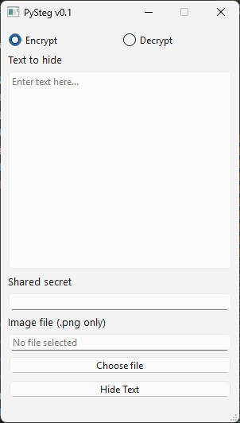

# PySteg

[](https://github.com/kisscool-fr/pysteg/actions/workflows/ci.yml)

A simple GUI for steganography: hide and reveal secret messages in images, with optional AES-256-GCM encryption and Argon2id key derivation.

Built as a replacement for [Steganozorus](https://thomasnerrant.com/steganozorus.htm) © 2002 – [Thomas Nerrant](https://thomasnerrant.com/).

## Sponsor

If you find this project useful, consider [buying me a coffee](https://www.buymeacoffee.com/kisscool).

## Features

- **Hide and reveal messages** in image files using LSB or EXIF steganography
- **AES-256-GCM encryption** with Argon2id key derivation from a shared secret
- **Plain text mode** to hide a message without encryption (useful for testing or low-risk payloads)
- Desktop GUI built with PyQt6

### Supported image formats

| Format | Technique |
|--------|-----------|
| PNG, BMP | LSB (least significant bit) |
| JPEG, TIFF | EXIF header |

When hiding text, the output file is saved next to the source image with a `_hidden` suffix (for example, `photo.png` → `photo_hidden.png`).

## Requirements

- Python 3.13
- [uv](https://docs.astral.sh/uv/) (recommended) or pip
- [just](https://github.com/casey/just) (optional, for recipe commands)

## Installation

First-time setup (creates a virtual environment with the Python version from `.python-version`):

```bash
just init
just install
```

Or with uv directly:

```bash
uv sync
```

## Usage

```bash
just run
```

Or:

```bash
uv run -m app
```

1. Choose **Hide** or **Reveal** mode.
2. Enter the text to hide, or leave the field empty in reveal mode.
3. Enter a shared secret (at least 8 characters), or enable plain text mode to skip encryption.
4. Select a cover image and run the action.

## Development

Common tasks via [just](https://github.com/casey/just):

```bash
just test      # run pytest
just format    # lint and format with ruff
just typing    # type-check with pyright
just ci        # full local CI pipeline
```

List all recipes with `just --list`.

## Screenshot



## Roadmap

- [ ] Choose output file name
- [ ] Add support for more encryption algorithms
- [ ] Add support for keyfiles
- [ ] Audio and video support, drag & drop
- [ ] Deniability support
- [ ] More languages
- [ ] Binary release
- [ ] Design improvements

## License

[MIT](LICENSE)

## Credits

[KisSCoOl](https://github.com/kisscool-fr/)
